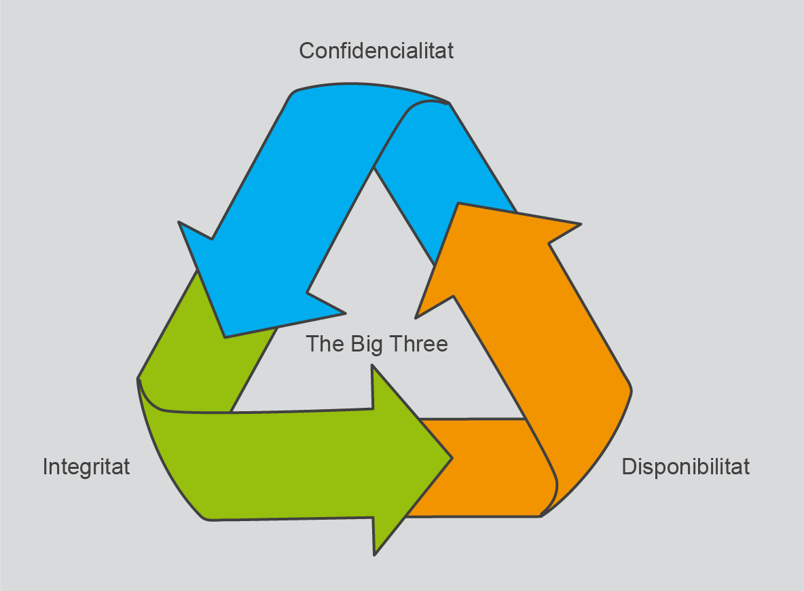
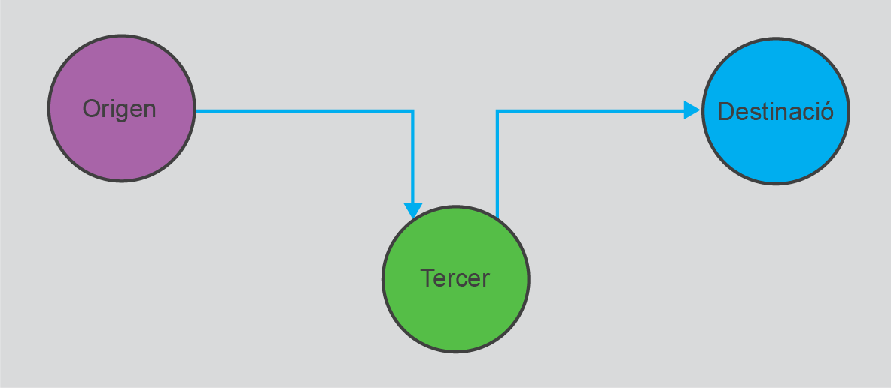
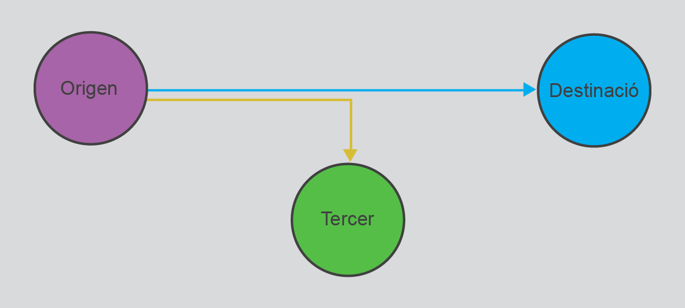

Seguretat de la informació
=========================

* [Resum](https://gitpitch.com/jrodr236/GBD-UF3/master?p=SeguretatDeLaInformacio)
* Exercicis teòrics: *moodle*
* [Exercicis pràctics](ExercicisSeguretatDeLaInformacio.md)

A l’hora de tractar la seguretat en les dades cal tenir present que l’objectiu final és minimitzar el risc de pèrdua o d’usos indeguts de la informació de les companyies protegint-ne els sistemes i la informació crítica.

Confidencialitat, integritat i disponibilitat de les dades
-----------------------------

Hi ha tres principis que ha de complir un sistema informàtic per garantir la
seva seguretat i la de les dades que hi formaran part. Són:
* confidencialitat,
* integritat,
* disponibilitat.

### Principi d'integritat

La integritat de les dades exigeix la garantia que les dades no han estat
alterades. A més, la integritat ofereix la seguretat que les
dades, una vegada gestionades amb altes, baixes, modificacions o consultes,
continuaran oferint un estat d'integritat, de consistència en què les seves
relacions i els seus vincles continuaran sent vàlids i certs.

L’objectiu de la integritat és protegir la base de dades contra operacions que
introdueixin inconsistències en les dades; d'aquesta manera el subsistema
d'integritat d'un SGBD ha de detectar i corregir, en la mesura que sigui
possible, les operacions incorrectes.

### Principi de disponibilitat

El principi de disponibilitat indica que les dades han de ser accessibles
i els serveis han d'estar operatius fins i tot en el cas de problemes de
subministrament elèctric, atacs als servidors, accidents o altres situacions
fortuïtes o provocades.

### Principi de confidencialitat

La confidencialitat garanteix que l’accés a les dades i a les comunicacions
queda protegit contra la intercepció i/o lectura de persones no autoritzades. Es tracta d'un principi molt important en el cas de dades de
caràcter personal i crític en el cas de dades bancàries.

Caràcter personal i el dret a la intimitat de les dades
----------------------

Hi ha molts tipus de dades, però la gran majoria són de caràcter personal o bé tenen una dependència força directa d'una persona o una organització. Fins i tot les dades que indiquen la quantitat d'unitats d'un producte determinat en un magatzem o els llibres que hi ha en una biblioteca tenen aquest tipus de dependència.

Normativa legal vigent
------------------------

### Llei de protecció de dades de caràcter personal

La Llei de protecció de dades de caràcter personal conté un total de 49 articles.
Aquests articles es divideixen en set títols i finalitzen amb una sèrie de disposicions.
A continuació, en podem trobar l’estructura:
* Títol I. Disposicions generals.
* Títol II. Principis de la protecció de dades.
* Títol III. Drets de les persones.
* Títol IV. Disposicions sectorials.
  * Capítol I. Fitxers de titularitat pública.
  * Capítol II. Fitxers de titularitat privada.
* Títol V. Moviments internacionals de dades.
* Títol VI. Agència Espanyola de Protecció de Dades.
* Títol VII. Infraccions i sancions.

[Text íntegre](http://administraciojusticia.gencat.cat/web/.content/documents/arxius/lo15_1999lopdcp.pdf)

Una **dada de caràcter personal** pot ser qualsevol informació numèrica,
alfabètica, fotogràfica, acústica o gràfica concernent a qualsevol persona
física viva que la pugui identificar directament o indirectament. Un tipus
especial de dada serà la relativa a la salut, que seran informacions que
concerneixin la salut passada, present i futura, física o mental, d'una
persona.

Un **fitxer** és qualsevol conjunt organitzat de dades de caràcter personal. Un
fitxer jurídic és el que és conformat per tots els fitxers físics o funcionals de
la corporació i servirà per a la notificació a l'ACPD.

El **tractament de dades** són totes les operacions i els procediments tècnics
que facin possible la gestió de les dades i que permetin cessions de dades a
altres mitjançant comunicacions, consultes o transferències.

Una **incidència** és qualsevol anomalia que afecti o pugui afectar la seguretat
de les dades. Entre aquestes anomalies hi ha algunes com el robatori de
contrasenyes o maquinari, la còpia no autoritzada de dades, l’aturada no
prevista del servei, la pèrdua de dades a un suport físic...

### Agència de Protecció de Dades

L’Agència de Protecció de Dades es va crear a partir de la Llei orgànica de
l’any 1992, la LORTAD. L’Agència es crea l’any 1993 com una entitat que
serà l’encarregada de vetllar pel compliment de les lleis orgàniques, primer
la LORTAD i després la LOPD a tot l’Estat espanyol.

La funció general de l’Agència de Protecció de Dades és la de vetllar pel
compliment de la legislació sobre protecció de dades i controlar la seva
aplicació, especialment pel que fa als drets d’informació, accés, rectificació,
oposició i cancel·lació de dades.

### Registre General de Protecció de Dades

El **Registre General de Protecció de Dades** és un òrgan de l’Agència
Espanyola de Protecció de Dades encarregat de controlar que les empreses
responsables facin publicitat de l’existència de fitxers i de la gestió de dades
de caràcter personal.

Els fitxers amb dades de caràcter personal s’hauran d'inscriure en el Registre
General de Protecció de Dades.

### Reglament General de Protecció de Dades de la Unió Europea

El Reglament General de Protecció de Dades (GDPR) és un reglament europeu mitjançant el qual pretenen enfortir i unificar protecció de dades per tots els països de la Unió europea (UE), controlant també la transferència de dades fora de la Unió.

Els seus principals objectius són retornar als ciutadans el control sobre la seva informació personal i unificar el marc regulador per a les multinacionals.

Suposa una llei més estricta que altres normes i es tracta de la primera norma sobre aquesta matèria que afecta a tots els països de la Unió Europea i unifica tant els drets com les obligacions.

Va entrar en vigor el 25 de maig de 2018, després d'un període de transició de dos anys, i, a diferència de les directives, no requereix incorporació a la legislació nacional, sent directament aplicable.

La GDPR substituirà la Llei Orgànica de Protecció de Dades de Caràcter Personal (LOPD), encara que aquesta es mantindrà en vigor en tot el que no contradigui el nou reglament fins que no s'aprovi la normativa que la substitueixi.

Amenaces a la seguretat
-------------------

La seguretat de les bases de dades es podrà validar en el moment en què les dades es vegin sotmeses a molts tipus diferents d'amenaces, tant accidentals com intencionades, com poden ser:

* Robatoris interns d'empleats de bases de dades.
* Frau i manipulació de les dades.
* Pèrdua de confidencialitat.
* Pèrdua de privacitat (a Internet i amb les xarxes socials).
